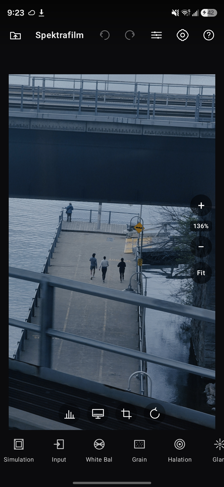
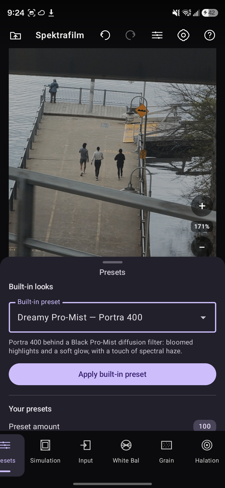
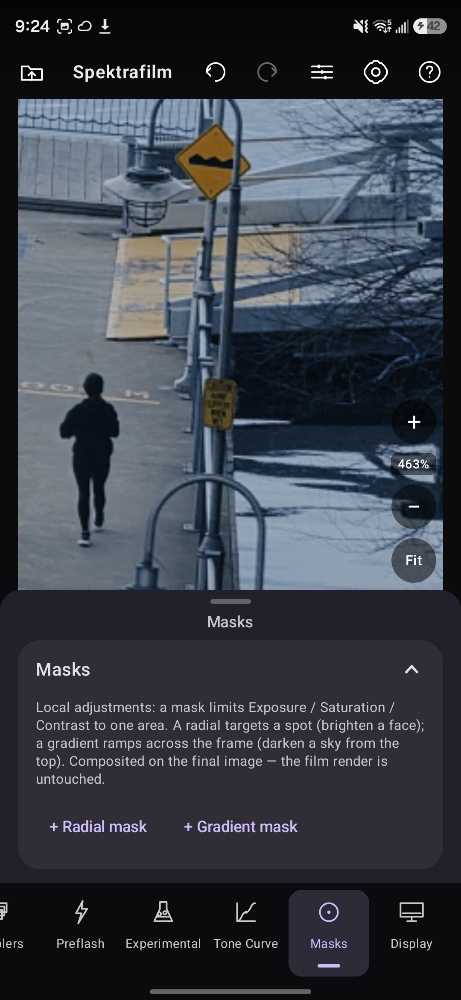
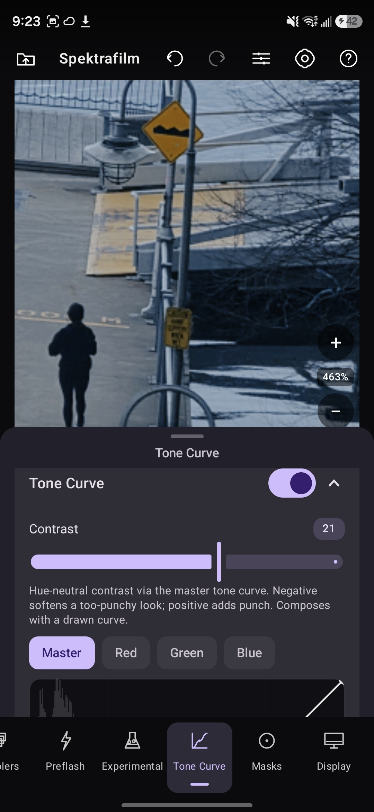

# Spektrafilm for Android

Spectral film simulation on your phone — a native port of the
[spektrafilm](https://github.com/andreavolpato/spektrafilm) engine, with a Jetpack Compose editor.

*Film modeling powered by [spektrafilm](https://github.com/andreavolpato/spektrafilm). Dedicated to
the [pixls.us](https://pixls.us) community.*

<table>
  <tr>
    <td></td>
    <td></td>
    <td></td>
    <td></td>
  </tr>
  <tr>
    <td align="center">Editor</td>
    <td align="center">Presets</td>
    <td align="center">Local masks</td>
    <td align="center">Tone curve</td>
  </tr>
</table>

## What it is

Most "film looks" are a color LUT — a lookup table that nudges your pixels toward a mood. This is not
that. Spektrafilm runs your photo through a physically-based simulation of the actual analog process:
it reconstructs a spectrum for each pixel, exposes a virtual emulsion that has real spectral
sensitivities, develops the dyes through the film's measured density curves, prints that negative
through a virtual enlarger onto paper, and scans the result. Negative, enlarger, print, scan — the
whole chain, the way it really happens.

The engine is a faithful C++ port of Andrea Volpato's research project. Every stage was checked
bit-for-bit against the original Python engine, so what you get on your phone matches what the
desktop tool produces. The science, the film-stock measurements, and the spectral data are all his
work; this project brings them to Android with an editor that should feel familiar if you've used
Lightroom.

## What you can do with it

**Choose a film and a paper.** 28 film and paper profiles — color negative, slide, motion-picture,
print film, and RGB papers — listed by friendly name and grouped by category, each with its ISO,
color balance, and era. The print path works for any film/paper pairing, not just preset
combinations.

**Start from a look, then make it yours.** 28 built-in presets cover researched film-and-print
combinations. You can save your own, and import or export them to share.

**Tune the whole pipeline.** Every parameter from the desktop tool is here, organized the same way:
exposure and auto-metering (7 patterns), DIR couplers, halation and in-emulsion scatter, diffusion
filters, the enlarger's dichroic filters and print exposure, grain (a stochastic particle model with
sublayers and micro-structure), and the scanner. Changes preview live.

**Edit like a photographer.** A tone curve (master plus per-channel red/green/blue), contrast,
saturation and vibrance, and local masks — radial and gradient — that adjust exposure, color,
clarity, and tone in just one part of the frame. Local edits sit on top of the film render; the
simulation underneath stays untouched.

**Get white balance right.** An eyedropper sets neutral from a tap, warmth and tint work on any
photo, and "balance to film stock" warms the input to a tungsten stock's reference light — the
digital equivalent of an 85 filter — so tungsten film doesn't render a daylight scene blue.

**Bring in RAW, send out real files.** RAW and DNG import through LibRaw (including Samsung Expert
RAW / compressed DNG), plus the usual photo picker and a built-in demo image. Export to JPEG, Ultra
HDR, 8- or 16-bit PNG, 16- or 32-bit TIFF, or a scene-linear TIFF for grading elsewhere — in any of
6 output color spaces, with source EXIF carried across. You can also export the look as a 3D LUT
(.cube or CLF).

**Keep your originals.** Edits are stored as a sidecar keyed to the source file and re-applied when
you reopen or export. The original RAW is never modified.

## Install

Download the APK from the [Releases](../../releases/latest) page (or grab the build artifact from the
latest green CI run), allow installs from unknown sources, and open it. Minimum Android 7.0 (API 24).
The native engine ships for arm64-v8a, armeabi-v7a, and x86_64.

## How it was made

This app stands on open color science and open source, and the credit belongs to the projects below.

- **[spektrafilm](https://github.com/andreavolpato/spektrafilm)** by **Andrea Volpato** is the engine
  this project ports — the spectral science, the film-stock profiles, and the LUTs are all his. If
  this is useful to you, please star spektrafilm and read his write-up on
  [discuss.pixls.us](https://discuss.pixls.us/t/spectral-film-simulations-from-scratch/48209).
- **[Image Toolbox](https://github.com/T8RIN/ImageToolbox)** by **T8RIN (Malik Mukhametzyanov)** —
  the Android image-editor architecture that shaped this app's design.
- **[colour-science](https://www.colour-science.org/)** — the color-science library whose color
  matching functions, illuminants, and transforms define what "correct" means here.
- **[LibRaw](https://www.libraw.org/)** — on-device RAW/DNG decoding.
- The **[pixls.us](https://pixls.us)** community, for keeping open photography and open color science
  alive and welcoming. This app is dedicated to you.

### A note on accuracy

The port was done parity-first. We ran the real Python engine headless as a live oracle, captured
golden vectors of every intermediate result, then ported each stage to C++ and gated it against
those vectors. A `tools/parity` harness and CI keep it honest on every commit.

| Stage | Difference vs the original |
|-------|----------------------------|
| Hanatos2025 spectral upsampling | ~1.1e-7 |
| Filming (expose → develop) + DIR couplers | ~1.2e-7 / 2.4e-7 |
| Printing (enlarger + dichroic filters) | ~2.4e-7 / 5.6e-7 |
| Scanning (spectral → XYZ → RGB) | ~6e-8 |
| Halation + scatter + coupler diffusion | ~1.5e-7 |
| Grain (stochastic) | mean-preserving; noise std matched |

Those are float32 rounding differences — the double-precision math reproduces the original exactly.
The architecture and the full stage-by-stage map are in [`docs/`](docs/).

## Author

Built and directed by **Akshay**.

- Instagram: [@akshay.pool](https://www.instagram.com/akshay.pool/)
- YouTube: [@Akshayishere](https://www.youtube.com/@Akshayishere/videos)

If the app brings you something, say hi and share your renders.

## Documentation

- [`docs/ARCHITECTURE.md`](docs/ARCHITECTURE.md) — engine and app architecture
- [`docs/PORTING_PLAN.md`](docs/PORTING_PLAN.md) — module-by-module port map
- [`docs/MOBILE_STRATEGY.md`](docs/MOBILE_STRATEGY.md) — parity and mobile design notes
- [`docs/RAW_DNG.md`](docs/RAW_DNG.md) — RAW/DNG decode notes
- [`tools/parity/`](tools/parity/) — the golden-vector parity harness
- [`NOTICE.md`](NOTICE.md) — attributions

## License

GPL-3.0 — see [`LICENSE`](LICENSE) and [`NOTICE.md`](NOTICE.md). Because this is a derivative of the
GPLv3 spektrafilm engine, the whole app is GPLv3. Please keep it open.
