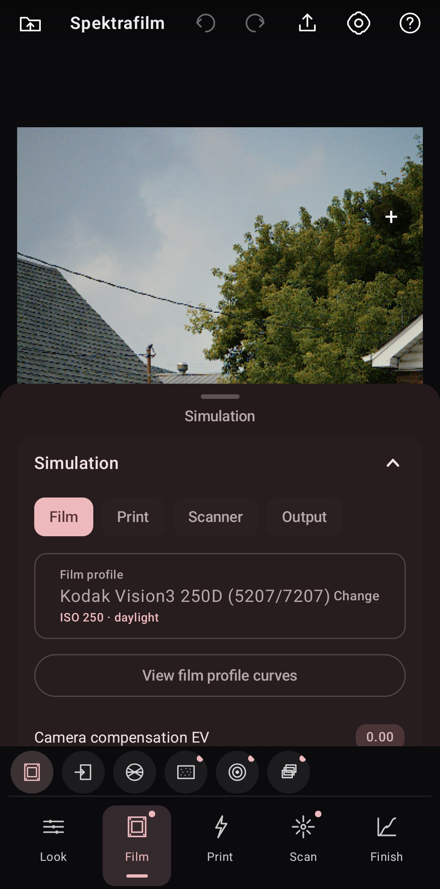
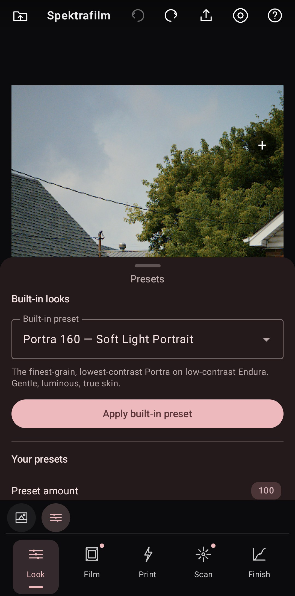
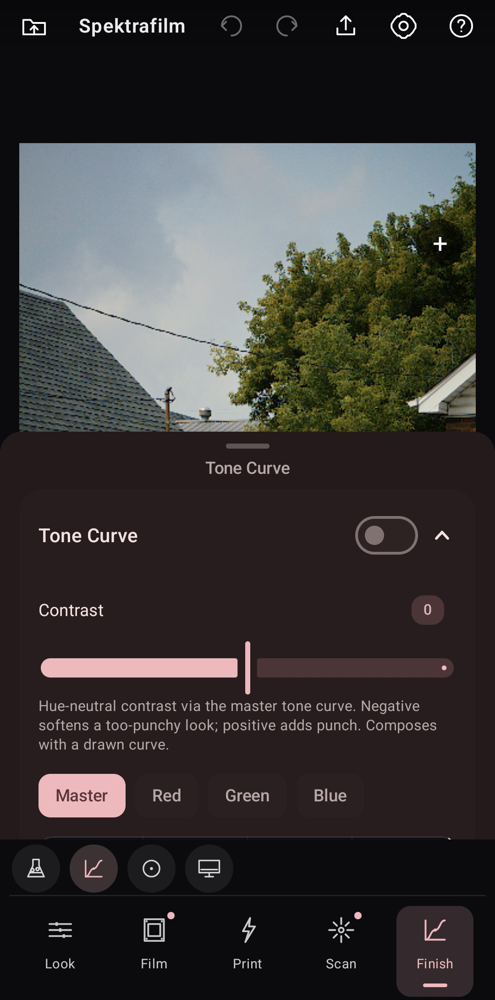
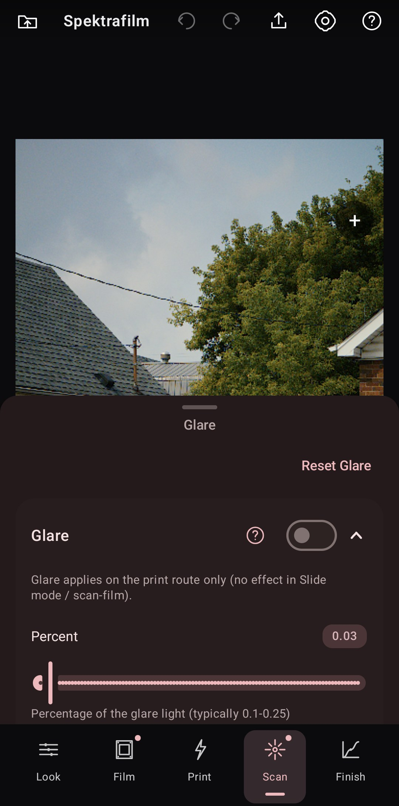

# Spektrafilm for Android

**Spectral film simulation on your phone.** Not a colour LUT — a physically-based simulation of the
whole analog chain: negative, enlarger, print, scan.

[-orange.svg)](docs/ARCHITECTURE.md)

*Film modeling powered by [spektrafilm](https://github.com/andreavolpato/spektrafilm).
Dedicated to the [pixls.us](https://pixls.us) community.*

<table>
  <tr>
    <td></td>
    <td></td>
    <td></td>
    <td></td>
  </tr>
  <tr>
    <td align="center">Film stock</td>
    <td align="center">Built-in looks</td>
    <td align="center">Tone curve</td>
    <td align="center">Scanner stage</td>
  </tr>
</table>

> [!NOTE]
> **Related project — Latent.** Latent is a computational engine built around the manipulation of
> RAW images. Spektrafilm for Android is the editor: you bring it a photo or a RAW file and it runs
> the spectral film simulation over it. The two are developed by the same author and share the same
> interest in getting RAW data right, but this app stands on its own and is maintained here.
>
> Live engineering work and known gates are in the [execution index](docs/EXECUTION_INDEX.md).

---

## What it is

Most "film looks" are a colour LUT — a lookup table that nudges your pixels toward a mood. This is
not that. Spektrafilm runs your photo through a physically-based simulation of the actual analog
process: it reconstructs a spectrum for each pixel, exposes a virtual emulsion that has real
spectral sensitivities, develops the dyes through the film's measured density curves, prints that
negative through a virtual enlarger onto paper, and scans the result. Negative, enlarger, print,
scan — the whole chain, the way it really happens.

The engine is a parity-first C++ port of Andrea Volpato's research project. Its stages are checked
against the pinned Python oracle within the declared numeric tolerance, with byte-identical output
across worker counts for the same build. That does not imply identical bytes across CPU
architectures, compiler builds, CPU and GPU routes, or encoded containers. The science, film-stock
measurements, and spectral data are upstream work; this project brings them to Android with an
editor that should feel familiar if you've used Lightroom.

## What you can do with it

**Choose a film and a paper.** 28 film and paper profiles — colour negative, slide, motion-picture,
print film, and RGB papers — listed by friendly name and grouped by category, each with its ISO,
colour balance, and era. The print path works for any film/paper pairing, not just preset
combinations.

**Start from a look, then make it yours.** 28 built-in presets cover researched film-and-print
combinations. You can save your own, and import or export them to share.

**Tune the film pipeline.** The current pinned port exposes exposure and auto-metering (7 patterns),
DIR couplers, halation and in-emulsion scatter, diffusion filters, the enlarger's dichroic filters
and print exposure, grain (a stochastic particle model with sublayers and micro-structure), and the
scanner. Latest-upstream coverage and any inert or unavailable controls are tracked explicitly; the
README does not treat an older parity baseline as permanent full-feature parity.

**Edit like a photographer.** A tone curve (master plus per-channel red/green/blue), contrast,
saturation and vibrance, and local masks — radial, gradient, and luminance/colour range with
eyedroppers — that adjust exposure, colour, clarity, texture, sharpness and tone in just one part of
the frame. Local edits sit on top of the film render; the simulation underneath stays untouched.

**Get white balance right.** An eyedropper sets neutral from a tap, warmth and tint work on any
photo, and "balance to film stock" warms the input to a tungsten stock's reference light — the
digital equivalent of an 85 filter — so tungsten film doesn't render a daylight scene blue.

**Bring in RAW, send out real files.** Supported RAW and DNG files use the pinned, patched LibRaw
decoder; unsupported compressed inputs may use Android's display-referred platform fallback and are
not claimed to be RAW/oracle-identical. The usual photo picker and a built-in demo image are also
available. Rendered JPEG, PNG8/16, and TIFF16/32F exports offer six output spaces. PNG16 and
rendered TIFF carry the selected ICC profile; bitmap JPEG/PNG8 tagging needs API 26+, falls back to
plain sRGB tagging on API 24–25, and cannot faithfully tag ACES in its 8-bit path. Scene-linear
TIFF32F is a separate pre-simulation export: verbatim decoded input primaries, deliberately untagged
and EXIF-Uncalibrated for grading elsewhere. An experimental Ultra HDR container exists, but its
honest gain-map/transfer release contract remains open. Source EXIF carry-through currently applies
to JPEG. You can also bake the engine look as a 3D LUT (`.cube` or CLF); that synthetic-lattice
operation excludes source-dependent and spatial/stochastic effects.

**Keep your originals.** Edits are stored as a sidecar keyed to the source file and re-applied when
you reopen or export. The original RAW is never modified.

## Install

Download the latest public APK from the
[Releases](https://github.com/thetechgeekko/Spektrafilm-android/releases/latest) page, allow installs
from unknown sources, and open it. CI artifacts are development evidence, not production-signed
releases. Minimum Android 7.0 (API 24). The native engine ships for arm64-v8a, armeabi-v7a, and
x86_64.

## Two render routes

| | Fast GPU (what the app runs) | Strict Exact CPU (the reference) |
|---|---|---|
| Runs on | Vulkan compute, f32 | CPU, f64 |
| Contract | tolerance-bounded against the CPU route | bit-exact against the oracle within tolerance |
| Determinism | same-device deterministic | byte-identical across worker counts |
| On failure | falls back to the CPU route | — |
| Used as parity evidence | never | yes |

**Since v0.10.0 the GPU route is how the app renders and exports.** The three GPU toggles that used
to sit in Settings are gone: the route is gated per device by its own self-check against the CPU
engine, with automatic fallback where they disagree, so there is nothing left for a user to choose.
A default export is therefore tolerance-bounded, not byte-identical to the CPU path.

Strict Exact CPU remains the parity-bearing reference — it is what the 44 gated cases measure, and
what "correct" means here. It is not currently selectable from the app.

## How it was made

This app stands on open colour science and open source, and the credit belongs to the projects
below.

- **[spektrafilm](https://github.com/andreavolpato/spektrafilm)** by **Andrea Volpato** is the engine
  this project ports — the spectral science, the film-stock profiles, and the LUTs are all his. If
  this is useful to you, please star spektrafilm and read his write-up on
  [discuss.pixls.us](https://discuss.pixls.us/t/spectral-film-simulations-from-scratch/48209).
- **[Image Toolbox](https://github.com/T8RIN/ImageToolbox)** by **T8RIN (Malik Mukhametzyanov)** —
  the Android image-editor architecture that shaped this app's design.
- **[colour-science](https://www.colour-science.org/)** — the colour-science library whose colour
  matching functions, illuminants, and transforms define what "correct" means here.
- **[LibRaw](https://www.libraw.org/)** — on-device RAW/DNG decoding.
- The **[pixls.us](https://pixls.us)** community, for keeping open photography and open colour
  science alive and welcoming. This app is dedicated to you.

### A note on accuracy

The port was done parity-first. We ran the real Python engine headless as an oracle, captured golden
vectors of intermediate results, then ported each stage to C++ and gated it against those vectors.
The current gate is oracle tolerance (`max_abs <= 1e-4`, `rms <= 1e-5`) plus same-build worker-count
invariance. A `tools/parity` harness and CI enforce 44 cases, twice: at `-O2` and at the flags the
release APK actually ships with.

| Stage | Difference vs the original |
|-------|----------------------------|
| Hanatos2025 spectral upsampling | ~1.1e-7 |
| Filming (expose → develop) + DIR couplers | ~1.2e-7 / 2.4e-7 |
| Printing (enlarger + dichroic filters) | ~2.4e-7 / 5.6e-7 |
| Scanning (spectral → XYZ → RGB) | ~6e-8 |
| Halation + scatter + coupler diffusion | ~1.5e-7 |
| Grain (stochastic) | mean-preserving; noise std matched |

These are representative stage measurements, not a promise of universal byte identity. Exactness
levels, current limitations, and the full implementation route are in the
[execution index](docs/EXECUTION_INDEX.md).

## Documentation

**Start here**

- [`docs/EXECUTION_INDEX.md`](docs/EXECUTION_INDEX.md) — current authority order and live-work loop
- [`docs/ARCHITECTURE.md`](docs/ARCHITECTURE.md) — engine and app architecture

**Contracts**

- [`docs/BIT_IDENTICAL_EXPORT_ROADMAP.md`](docs/BIT_IDENTICAL_EXPORT_ROADMAP.md) — exactness and performance
- [`docs/JNI_LIFETIME_SAFETY.md`](docs/JNI_LIFETIME_SAFETY.md) — the native boundary
- [`docs/TRANSACTIONAL_STORAGE.md`](docs/TRANSACTIONAL_STORAGE.md) — storage and URI access
- [`docs/LICENSING.md`](docs/LICENSING.md) — licence obligations
- [`docs/RAW_DNG.md`](docs/RAW_DNG.md) — RAW/DNG decode notes

**Release and process**

- [`docs/RELEASE_CHECKLIST.md`](docs/RELEASE_CHECKLIST.md) — maintainer release checklist
- [`docs/PRODUCTION_READINESS_PLAN.md`](docs/PRODUCTION_READINESS_PLAN.md) — release acceptance
- [`CONTRIBUTING.md`](CONTRIBUTING.md) — how to build, gate, and submit a change
- [`SECURITY.md`](SECURITY.md) — reporting a vulnerability
- [`CHANGELOG.md`](CHANGELOG.md) — what changed, per version
- [`tools/parity/`](tools/parity/) — the golden-vector parity harness

Dated files (`docs/AUDIT.md`, `docs/*_2026-*.md`) and `docs/research/**` record findings from when
they were written. They are evidence, not a work queue.

## Author

Built and directed by **Akshay**.

- Instagram: [@akshay.pool](https://www.instagram.com/akshay.pool/)
- YouTube: [@Akshayishere](https://www.youtube.com/@Akshayishere/videos)

If the app brings you something, say hi and share your renders.

## License

GPL-3.0 — see [`LICENSE`](LICENSE) and [`NOTICE.md`](NOTICE.md). Because this is a derivative of the
GPLv3 spektrafilm engine, the whole app is GPLv3. Please keep it open.

### Using this code in your own app

You are welcome to — that is what the licence is for, including commercially. Two obligations
come with it.

**1. GPLv3.** A work based on this one is GPLv3 too, and you must offer your users the
corresponding source. Shipping it inside a closed-source app is not permitted.

**2. Attribution (a required notice under [GPLv3 §7(b)](NOTICE.md)).** Display this in your
about / credits / licences screen, or your store listing, with both links clickable where the
medium allows:

> **Spektrafilm for Android** by **Akshay Sharma** —
> <https://github.com/thetechgeekko/Spektrafilm-android>
>
> Film modeling powered by **spektrafilm** (Andrea Volpato) —
> <https://github.com/andreavolpato/spektrafilm>

Both lines, please. The film-simulation engine is a port of Andrea Volpato's spektrafilm, so
crediting this port while dropping the upstream engine would misrepresent whose work you are
shipping. The full term, and exactly what it does and does not require, is in
[`NOTICE.md`](NOTICE.md).
